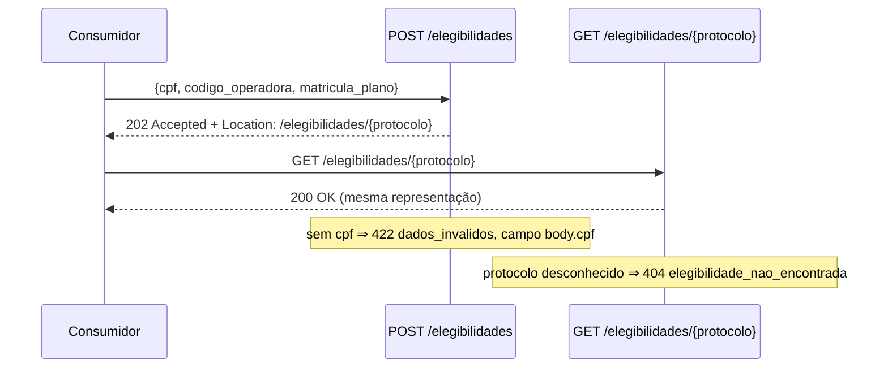

# 2.6 — Oficina de ferramentas: contrato, execução e comparação

Oficina do Módulo 2 (Arquitetura de APIs) executada sobre a **API de
elegibilidades da plataforma hospitalar** (`laboratorios/plataforma-hospitalar`).
O objetivo é tornar observável um contrato HTTP pequeno — duas operações —
comparando a intenção declarada (OpenAPI), a execução da implementação (FastAPI
via `TestClient`) e a experiência do consumidor (Bruno/curl). Nenhuma integração
externa é chamada; os dados ficam somente na memória do processo.

## O contrato em uma olhada

A aplicação expõe duas operações públicas, definidas em `contratos/openapi.yaml`
e implementadas em `src/hospital/api/main.py`:

| Operação | Papel na oficina | Resultado observável |
| --- | --- | --- |
| `POST /elegibilidades` | valida CPF, código de operadora e matrícula e aceita o pedido | `202 Accepted`, corpo com `protocolo`/`situacao` e cabeçalho `Location` |
| `GET /elegibilidades/{protocolo}` | recupera o pedido aceito pelo protocolo | `200 OK` com a representação; `404` se o protocolo não existir |

Schemas do contrato: `PedidoElegibilidade` (requisição), `ElegibilidadeAceita`
(resposta de sucesso) e `ErroAPI` (`codigo`, `mensagem`, `detalhes`), os três com
`additionalProperties: false` — propriedades fora do contrato são rejeitadas com
`422`.

## Arquitetura

```mermaid
graph TD
    subgraph Consumidor["Consumidor"]
        B["Bruno / curl / /docs"]
    end
    subgraph API["API de elegibilidades (FastAPI)"]
        M["main.py — rotas /elegibilidades\nPOST criarElegibilidade\nGET consultarElegibilidade"]
        MD["models.py — PedidoElegibilidade\nElegibilidadeAceita · ErroAPI"]
        ST["storage em memória\n(dict de ElegibilidadeAceita)"]
    end
    subgraph Ferramentas["Verificação"]
        S["Spectral 6.16.1\nlint de contratos/openapi.yaml"]
        T["pytest + TestClient\ntests/test_api_contract.py"]
    end
    C["contratos/openapi.yaml\n(contrato explícito)"]

    Consumidor -->|HTTP| M
    M --> MD
    M --> ST
    M -.->|gera app.openapi()| X["contrato gerado"]
    C -.->|valida| S
    T -.->|TestClient executa a app| M
    S -.-> C

    classDef cons fill:#1a3a5c,stroke:#4d9ef7,color:#cce4ff
    classDef api fill:#1a3d1a,stroke:#4caf50,color:#d4f0d4
    classDef fer fill:#3d2000,stroke:#e07040,color:#ffe0cc
    classDef con fill:#2d1a40,stroke:#9c6ab3,color:#e8d4f0

    class Consumidor cons
    class M,MD,ST api
    class S,T, X fer
    class C con
```

### Fluxo: POST → GET



## Ferramentas

| Ferramenta | Papel nesta oficina | Evidência |
| --- | --- | --- |
| Python 3.12 + FastAPI + Uvicorn | implementar e servir HTTP local | respostas e `/docs` |
| OpenAPI 3.1 | declarar o contrato explícito | `contratos/openapi.yaml` |
| `TestClient` (Starlette/httpx) | verificar o comportamento da implementação | `testes-contrato.txt` |
| Bruno | consumidor manual | requisições salvas em `evidencias/execucao/` |
| Spectral CLI 6.16.1 | revisar o documento | `spectral-valido.txt` e experimento deliberado |

## Execução (resumo)

Tudo foi executado a partir de `laboratorios/plataforma-hospitalar`, no ambiente
`.venv` com Python 3.12.12.

```bash
python -m uvicorn hospital.api.main:app --reload
```

Confirmações: o terminal informou `Uvicorn running on http://127.0.0.1:8000`;
`http://127.0.0.1:8000/docs`, `/openapi.json` e `/health/live` responderam `200`.

### POST válido → `202` com `Location`

```bash
curl -i -X POST http://127.0.0.1:8000/elegibilidades \
  -H "Content-Type: application/json" \
  -d '{"cpf":"12345678901","codigo_operadora":"OPS-001","matricula_plano":"MAT-2026-001"}'
```

Saída real (`evidencias/execucao/post-ok.txt`):

```
HTTP/1.1 202 Accepted
location: /elegibilidades/542ab6b5-d5d8-4014-be96-42208dee3a20

{"protocolo":"542ab6b5-d5d8-4014-be96-42208dee3a20","situacao":"recebida","criado_em":"2026-08-28T20:34:25.855572Z"}
```

### GET de recuperação → `200`

```bash
curl -i http://127.0.0.1:8000/elegibilidades/542ab6b5-d5d8-4014-be96-42208dee3a20
```

Saída real (`evidencias/execucao/get-ok.txt`): `200 OK` retorna exatamente a mesma
representação do `POST` — a recuperação não transforma o estado, apenas o devolve.

### POST sem `cpf` → `422` estruturado

```bash
curl -i -X POST http://127.0.0.1:8000/elegibilidades \
  -H "Content-Type: application/json" \
  -d '{"codigo_operadora":"OPS-001","matricula_plano":"MAT-2026-001"}'
```

Saída real (`evidencias/execucao/post-422.txt`):

```
HTTP/1.1 422 Unprocessable Entity
{"codigo":"dados_invalidos","mensagem":"A requisição não atende ao contrato.",
 "detalhes":[{"campo":"body.cpf","mensagem":"Field required","tipo":"missing"}]}
```

## Verificação por contrato e por teste

### Spectral (contrato válido)

```bash
npx --yes @stoplight/spectral-cli@6.16.1 lint contratos/openapi.yaml
```

Saída real (`evidencias/spectral-valido.txt`):

```
No results with a severity of 'error' found!
```

### Testes de contrato

```bash
python -m pytest tests/test_api_contract.py -q
```

Saída real (`evidencias/testes-contrato.txt`): **`7 passed`**. A oficina menciona
seis testes, mas o `test_api_contract.py` do repositório contém sete funções de
teste — ver observações.

### Falha deliberada (evidência do linter)

Copiei o contrato para `evidencias/openapi-experimento.yaml` e alterei **somente**
o exemplo de mídia `cpf` de `12345678901` para `123`
(em `paths./elegibilidades.post.requestBody.content.application/json.examples.pedidoValido.value.cpf`);
o schema e o exemplo de `components` não foram tocados. Rodando o Spectral na cópia:

```bash
npx --yes @stoplight/spectral-cli@6.16.1 lint evidencias/openapi-experimento.yaml
```

Saída real (`evidencias/spectral-experimento-falha.txt`):

```
 34:24  error  oas3-valid-media-example  "cpf" property must match pattern "^\d{11}$"
                paths./elegibilidades.post.requestBody.content.application/json.examples.pedidoValido.value.cpf
✖ 1 problem (1 error, 0 warnings, 0 infos, 0 hints)
```

A falha é cogitada **antes** de chamar a API: o exemplo de mídia não satisfaz o
padrão declarado `^\d{11}$`. A implementação, pela mesma regra em
`src/hospital/api/models.py` (`Field(pattern=r"^\d{11}$")`), também rejeitaria o
mesmo valor com `422` — contrato e código concordam sobre o que é um CPF válido.
A cópia com falha foi mantida somente como evidência, sem substituir
`contratos/openapi.yaml`.

## Extensão: contrato explícito × contrato gerado

`app.openapi()` gera o documento a partir dos decorators e modelos. Comparei os
status de resposta documentados e gerados (`evidencias/comparacao-contratos.txt`):

| Operação | Status no documento | Status gerados |
| --- | --- | --- |
| `POST /elegibilidades` | `202`, `422` | `202`, `422` |
| `GET /elegibilidades/{protocolo}` | `200`, `404` | `200`, `404`, **`422`** |

Há uma **divergência real**: a implementação gera um `422` para o `GET`
(validação automática do parâmetro de path `protocolo`), que o documento
explícito não promete. É uma diferença de cobertura, não de contrato quebrado:
os status prometidos existem na implementação, mas a implementação produz um
status adicional não documentado. Isso mostra a diferença entre compatibilidade
(e o que é prometido está implementado) e documentação completa (a implementação
faz mais do que o documento descreve). `PedidoElegibilidade.required` é idêntico
nos dois documentos, e os seis testes que validam os exemplos contra os modelos
passam — o núcleo do contrato está alinhado.

## Arquivos de evidência

```
entregas/unidade-2/oficina-de-ferramentas/
├── README.md
├── observacoes.md
└── evidencias/
    ├── testes-contrato.txt            # 7 passed
    ├── spectral-valido.txt            # No results with severity 'error'
    ├── spectral-experimento-falha.txt # oas3-valid-media-example (deliberado)
    ├── openapi-experimento.yaml       # cópia com cpf=123 (falha deliberada)
    ├── comparacao-contratos.txt       # explícito × gerado
    └── execucao/
        ├── post-ok.txt                # 202 + Location
        ├── get-ok.txt                 # 200
        └── post-422.txt               # 422 dados_invalidos / body.cpf
```
