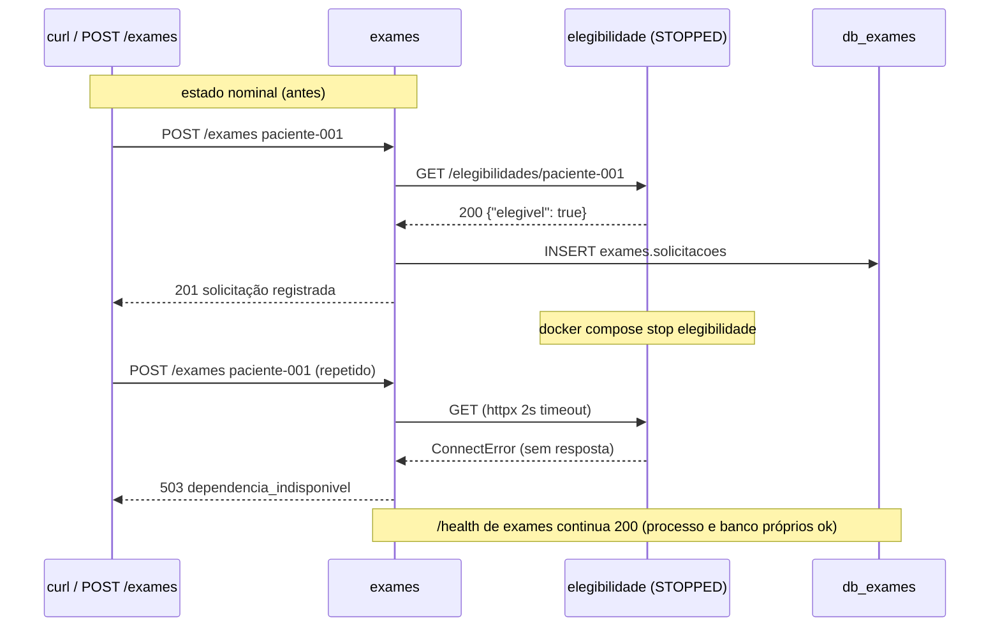

# 3.7 — Oficina de ferramentas: dois serviços, dois bancos e uma falha parcial

Oficina do Módulo 3 (Arquitetura de Serviços) executada sobre a demonstração
descartável `laboratorios/plataforma-hospitalar/infra/compose.servicos.yml`.
Ela reúne dois serviços FastAPI (`elegibilidade` e `exames`) e duas bases
PostgreSQL (`db_elegibilidade` e `db_exames`). Dois problemas arquiteturais são
tornados observáveis: **uma fronteira de dados** (Exames consome Elegibilidade
somente por contrato HTTP, nunca por acesso direto ao banco) e **uma falha
parcial** (Elegibilidade para, Exames continua saudável mas deixa de concluir
novas solicitações).

## Arquitetura da demonstração

```mermaid
graph LR
    subgraph HTTP["Clients (curl / TestClient)"]
        C["POST /exames · GET /health"]
    end

    subgraph RedeAplicacao["application-net (compartilhada: HTTP entre serviços)"]
        E["elegibilidade\nFastAPI :8000\n(exposto em :18001)"]
        X["exames\nFastAPI :8000\n(exposto em :18002)"]
    end

    subgraph RedeElig["elegibilidade-db-net (internal)"]
        DBE[("db_elegibilidade\nPostgreSQL")]
    end

    subgraph RedeExa["exames-db-net (internal)"]
        DBX[("db_exames\nPostgreSQL")]
    end

    C -->|HTTP| X
    X -->|GET /elegibilidades/{id}\nhttpx 2s timeout| E
    E -->|psycopg| DBE
    X -->|psycopg| DBX

    X -.->|bloqueado: rede internal\nExames não resolve elegibilidade-db| DBE

    classDef app fill:#1a3a5c,stroke:#4d9ef7,color:#cce4ff
    classDef db fill:#1a3d1a,stroke:#4caf50,color:#d4f0d4
    classDef cli fill:#3d2000,stroke:#e07040,color:#ffe0cc
    class C cli
    class E,X app
    class DBE,DBX db
```

Cada banco fica em uma rede **internal** própria, com alias de DNS próprio
(`elegibilidade-db`, `exames-db`). Os processos compartilham somente a
`application-net` necessária ao HTTP. Mesmo que Exames descubra o alias
`elegibilidade-db`, ele não consegue resolvê-lo pela sua rede — a propriedade
dos dados é reforçada por topologia, não só por convenção de código.

## A fronteira de dados

| Serviço | Dado autoritativo | Acesso | Rede |
| --- | --- | --- | --- |
| `elegibilidade` | `elegibilidade.beneficiarios` (`paciente-001` elegível) | somente ele, via credencial do próprio banco | `elegibilidade-db-net` (internal) |
| `exames` | `exames.solicitacoes` | somente ele, via credencial do próprio banco | `exames-db-net` (internal) |

Exames precisa saber se o beneficiário pode prosseguir. Ele **não** lê a tabela
de Elegibilidade: consulta `GET /elegibilidades/{beneficiario_id}` e grava a
solicitação na própria base. O teste `test_exames_source_cannot_access_eligibility_table_directly`
verifica o código-fonte em busca de `elegibilidade.beneficiarios`,
`from elegibilidade`, `join elegibilidade` e `db_elegibilidade` — nenhuma das
quatro formas de acoplamento de dados existe.

## Ferramentas

| Ferramenta | Versão | Papel nesta oficina |
| --- | --- | --- |
| Docker Engine | 29.7.2 | contêineres e redes |
| Docker Compose | v5.5.0 | orquestração + health checks |
| Python | 3.12.12 (`.venv`) | aplicações e testes |
| FastAPI + httpx + psycopg | via `.[dev]` | HTTP e persistência isolada |
| PostgreSQL 16 (alpine) | imagem do Compose | dois bancos isolados |

Ver versões completas em `evidencias/versoes.txt`.

## Roteiro executado

Portas escolhidas (fora dos padrões 8001/8002): `ELEGIBILIDADE_PORT=18001` e
`EXAMES_PORT=18002`.

### 1. Validar configuração

```bash
docker compose -f infra/compose.servicos.yml config --quiet   # exit 0, sem texto
docker compose -f infra/compose.servicos.yml config --services
```

`--services` listou os quatro nomes esperados: `db_elegibilidade`,
`db_exames`, `elegibilidade` e `exames` (`evidencias/config-services.txt`).

### 2. Iniciar e inspecionar

```bash
docker compose -f infra/compose.servicos.yml up -d --build --wait
docker compose -f infra/compose.servicos.yml ps
```

`--wait` terminou quando os quatro health checks ficaram saudáveis
(`evidencias/ps-inicial.txt`): os dois bancos e as duas aplicações `healthy`,
com `0.0.0.0:18001->8000` e `0.0.0.0:18002->8000`.

```bash
curl -i "http://localhost:${ELEGIBILIDADE_PORT}/health"   # 200
curl -i "http://localhost:${EXAMES_PORT}/health"          # 200
```

Saída real (`evidencias/health-elegibilidade.txt`):

```
HTTP/1.1 200 OK
{"status":"ok","servico":"elegibilidade"}
```

### 3. Estado nominal — criar exame

```bash
curl -i -X POST "http://localhost:${EXAMES_PORT}/exames" \
  -H 'Content-Type: application/json' \
  -d '{"beneficiario_id":"paciente-001","codigo_exame":"HEM-001"}'
```

Saída real (`evidencias/post-exame-201.txt`):

```
HTTP/1.1 201 Created
{"beneficiario_id":"paciente-001","codigo_exame":"HEM-001","solicitacao_id":1,"situacao":"solicitado"}
```

O `201` só ocorre porque Elegibilidade respondeu `{"elegivel": true}` para
`paciente-001` — a capacidade de criar exame depende temporalmente do serviço
de elegibilidade, sem compartilhar dados com ele.

### 4. Falha parcial

```bash
docker compose -f infra/compose.servicos.yml stop elegibilidade
docker compose -f infra/compose.servicos.yml ps
```

`ps` (evidência `ps-apos-stop.txt`) agora lista **três** contêineres: os dois
bancos permanecem `healthy` e Exames permanece `healthy`; só
`elegibilidade` está parado.

Repetir o mesmo `POST /exames`:

Saída real (`evidencias/post-exame-503.txt`):

```
HTTP/1.1 503 Service Unavailable
{"detail":{"codigo":"dependencia_indisponivel"}}
```

Enquanto isso, `GET /health` de Exames continua `200`
(`evidencias/health-exames-pos-falha.txt`) — o processo e a base de Exames
não pararam. **Esta é a falha parcial**: uma parte do fluxo falha, a outra
segue viva, e o erro é mapeado para a semântica correta (`503
dependencia_indisponivel`), não para um `500` genérico.



### 5. Recuperar e verificar

```bash
docker compose -f infra/compose.servicos.yml up -d --wait
```

Os quatro serviços voltaram a `healthy` (`evidencias/ps-pos-recuperacao.txt`)
e os dois `/health` retornaram `200`. O mesmo `POST /exames` voltou a
responder `201` (`evidencias/post-exame-201-recuperado.txt`).

Detalhe observável: a segunda solicitação recebeu `solicitacao_id: 2`. Como
usei `stop` (e não `down`), o contêiner e o volume `exames_data`
sobreviveram; a base continuou contando de onde parou. O enunciado registra
que, após `down -v`, o identificador volta ao primeiro valor da nova base.

### 6. Testes de fronteira

```bash
python -m pytest tests/test_service_boundaries.py -q
```

Resultado real (`evidencias/testes-fronteiras.txt`): **`4 passed`**, incluindo
`test_exames_makes_its_own_database_failure_observable` e
`test_exames_source_cannot_access_eligibility_table_directly`. Os quatro
testes cobrem, sem depender do Compose:

1. Exames consome Elegibilidade **somente** por contrato HTTP (`MockTransport`
   intercepta o GET e Exames grava a solicitação);
2. **falha parcial** observável: dependência fora do ar ⇒ `503
   dependencia_indisponivel`;
3. **falha da base própria** observável: `psycopg.OperationalError` em
   `registrar_solicitacao` ⇒ `503 banco_indisponivel`;
4. **ausência de SQL contra a tabela de Elegibilidade** no código-fonte de
   Exames.

## Limpeza

```bash
docker compose -f infra/compose.servicos.yml down -v
docker compose -f infra/compose.servicos.yml ps -a
```

`down -v` removeu contêineres, redes `elegibilidade-db-net`,
`exames-db-net` e `application-net` e os volumes `elegibilidade_data` e
`exames_data` (`evidencias/down-v.txt`). `ps -a` passou a não listar nenhum
recurso ativo, e nenhum volume do projeto permaneceu
(`evidencias/ps-pos-limpeza.txt`).

## Interpretação e respostas às questões

**Qual dependência permanece saudável e qual capacidade deixa de ser
concluída?**

Com `elegibilidade` parado, permanecem saudáveis: os dois bancos
(`db_elegibilidade` e `db_exames`) e o processo de Exames — todos `healthy` no
`ps`. A capacidade que deixa de ser concluída é **criar exame**: o `POST
/exames` não completa (`503 dependencia_indisponivel`), porque depende
temporalmente da resposta síncrona de Elegibilidade. `GET /health` de Exames
continua `200` justamente porque o health check confirma processo + banco
próprio, não dependências remotas — coerente com o enunciado.

## Arquivos de evidência

```
entregas/unidade-3/oficina-de-ferramentas/
├── README.md
├── observacoes.md
└── evidencias/
    ├── versoes.txt                  # docker/compose/python
    ├── config-quiet.txt             # config --quiet (exit 0)
    ├── config-services.txt          # 4 nomes de serviço
    ├── up-inicial.txt               # up -d --build --wait
    ├── up-recuperacao.txt           # up -d --wait após a falha
    ├── ps-inicial.txt               # 4 serviços healthy
    ├── health-elegibilidade.txt     # 200
    ├── health-exames.txt            # 200
    ├── post-exame-201.txt           # 201 + solicitacao_id 1
    ├── stop-elegibilidade.txt
    ├── ps-apos-stop.txt             # 3 serviços healthy
    ├── post-exame-503.txt           # 503 dependencia_indisponivel
    ├── health-exames-pos-falha.txt  # 200 (Exames segue vivo)
    ├── ps-pos-recuperacao.txt       # 4 serviços healthy
    ├── post-exame-201-recuperado.txt# 201 + solicitacao_id 2
    ├── testes-fronteiras.txt        # 4 passed
    ├── down-v.txt                   # remoção de contêineres, redes e volumes
    └── ps-pos-limpeza.txt           # nenhum recurso ativo
```

As mesmas evidências também estão em
`laboratorios/plataforma-hospitalar/evidencias/modulo-3/`, conforme a
preparação do laboratório.