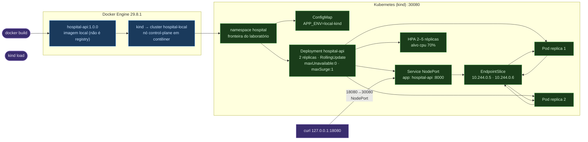

# 6.6 — Oficina de ferramentas: Docker, kind e Kubernetes locais

Oficina do Módulo 6 (Bases de computação em nuvem) executada sobre a demonstração
descartável `laboratorios/plataforma-hospitalar`. Ela constrói localmente a imagem
`hospital-api:1.0.0` a partir do `Dockerfile`, cria um cluster Kubernetes
**descartável** `hospital-local` com o kind, e aplica os cinco manifestos de
`infra/k8s` (namespace, configmap, deployment, service e HPA). O acesso fica
limitado a `127.0.0.1:18080` — nenhum dado, credencial ou imagem é enviado a
serviço remoto, e nenhum comando aponta para um contexto compartilhado.

São tornadas observáveis três propriedades arquiteturais: **reconciliação
declarativa** (o Deployment convergiu para o estado pedido: 2 réplicas prontas),
**atualização gradual com sondas** (readiness em `/health/ready` mantém um Pod fora
dos endpoints até poder receber tráfego; liveness em `/health/live` apenas mantém
o processo vivo) e **contenção por rollback** (uma tag de imagem propositalmente
ausente bloqueia o rollout com `ImagePullBackOff`, e `rollout undo` restaura a
revisão saudável).

## Arquitetura da demonstração



O Kubernetes não produz a imagem nem a move: `docker build` a materializa (usuário
sem privilégios, porta 8000) e `kind load docker-image` a torna visível para o nó.
O cluster apenas **reconcilia o estado declarado**: cria o namespace antes dos
recursos que o usam, mantém duas réplicas disponíveis, e redes cobre o Service
NodePort 30080 com o host local em `127.0.0.1:18080`.

## Ferramentas

| Ferramenta | Versão | Papel nesta oficina |
| --- | --- | --- |
| Docker Engine | 29.8.1 | constrói a imagem e hospeda o nó kind |
| kind | v0.27.0 | cria cluster Kubernetes local descartável `hospital-local` |
| kubectl | v1.31.4 | dry-run, apply, rollout, describe e leitura do estado |
| Kubernetes (kind) | control-plane único | reconcilia Deployment, Service, HPA e probes |
| Python | 3.12.12 (`.venv`) | testes estáticos dos manifestos (`pytest`) |

Ver versões completas em `evidencias/versoes.txt`. O kind e o kubectl foram
instalados em `~/.local/bin` (ambiente Linux sem `sudo` para o socket Docker,
conforme política da oficina).

## Roteiro executado

Todos os nomes e portas são fixos: cluster `hospital-local`, namespace `hospital`,
Deployment/Service `hospital-api`, porta do contêiner `8000`, acesso local
`http://127.0.0.1:18080`. Não alterei nenhum manifest durante a aula.

### 1. Pré-requisitos e estado inicial

```bash
docker version
kind version
kubectl version --client
python3 --version
kubectl config current-context
kind get clusters
```

Docker mostra Client e Server; o contexto inicial `kubectl config current-context`
devolve `error: current-context is not set` (nenhum contexto definido antes do
cluster) e `kind get clusters` retorna `No kind clusters found`.
(`evidencias/versoes.txt`, `evidencias/contexto.txt`.)

> Nota sobre o dry-run: com o kubectl v1.31.4, `kubectl apply --dry-run=client`
> busca o schema OpenAPI **no servidor** para validar. Sem cluster, o comando
> falha (`failed to download openapi … connection refused`). Para registrar a
> validação sem servidor, apliquei a contingência estática da oficina
> (`--validate=false` mais `pytest`) e, **depois de criar o cluster**, rodei o
> dry-run original com sucesso. Detalhes em `observacoes.md`.

### 2. Validação estática e preparação do cluster

```bash
cd /home/miguel/arquitetura-software/laboratorios/plataforma-hospitalar
docker build -t hospital-api:1.0.0 .
kind create cluster --name hospital-local --config infra/kind/cluster.yaml
kind load docker-image hospital-api:1.0.0 --name hospital-local
kubectl config current-context
```

Saída real (`evidencias/kind-create.txt`): cluster `hospital-local` criado com o
nó `hospital-local-control-plane` e `Set kubectl context to "kind-hospital-local"`.
O `kind load` confirma que a imagem `sha256:f4544ef415c7…` "not yet present on node
…, loading…" (`evidencias/kind-load.txt`). O contexto final é
`kind-hospital-local` (`evidencias/contexto.txt`), e `docker image inspect`
registra usuário `app`, porta `8000/tcp`, `linux/amd64`
(`evidencias/docker-image-inspect.txt`).

```bash
kubectl apply --dry-run=client -f infra/k8s/namespace.yaml
kubectl apply --dry-run=client -f infra/k8s/configmap.yaml \
  -f infra/k8s/deployment.yaml -f infra/k8s/service.yaml -f infra/k8s/hpa.yaml
.venv/bin/python -m pytest tests/test_k8s_manifests.py -q
```

Com o cluster no ar, o dry-run devolve `namespace/hospital created (dry run)` e,
para os quatro recursive: `configmap/hospital-api-config created (dry run)`,
`deployment.apps/hospital-api created (dry run)`, `service/hospital-api created
(dry run)`, `horizontalpodautoscaler.autoscaling/hospital-api created (dry run)`
(`evidencias/dryrun-cluster.txt`). A bateria estática de manifestos passou
`3 passed in 0.06s` (`evidencias/pytest.txt`).

### 3. Aplicar e comprovar o rollout

```bash
kubectl apply -f infra/k8s/namespace.yaml
kubectl apply -f infra/k8s/configmap.yaml -f infra/k8s/deployment.yaml \
  -f infra/k8s/service.yaml -f infra/k8s/hpa.yaml
kubectl rollout status deployment/hospital-api -n hospital
kubectl get deployment,pods,service,hpa -n hospital -o wide
curl --fail --silent http://127.0.0.1:18080/health/ready
kubectl get endpointslice -n hospital -l kubernetes.io/service-name=hospital-api
```

Saída real (`evidencias/apply.txt`, `evidencias/rollout-inicial.txt`,
`evidencias/get-wide.txt`): o rollout informa duas réplicas disponíveis e a lista
`-o wide` mostra `deployment.apps/hospital-api 2/2… AVAILABLE 2`, dois Pods
`Running` (`10.244.0.5` e `10.244.0.6`), Service `NodePort 8000:30080/TCP` e HPA
`cpu: <unknown>/70%`. Readiness devolve `{"status":"ready"}`
(`evidencias/curl-ready.txt`) e o EndpointSlice contém os dois endereços prontos:
`ENDPOINTS 10.244.0.5,10.244.0.6` (`evidencias/endpointslice.txt`).

> O HPA apresenta `<unknown>`: sem Metrics Server, o kind básico não expõe a
> métrica de CPU. A oficina manda registrar esse fato em vez de inventar
> escalonamento (`evidencias/hpa-describe.txt`, `evidencias/hpa-get.txt`).

### 4. Contenção: imagem ausente e rollback

A única alteração abaixo é uma tag de imagem propositalmente ausente — não usei
uma tag de ambiente real.

```bash
kubectl set image deployment/hospital-api \
  hospital-api=hospital-api:imagem-propositalmente-ausente -n hospital
kubectl rollout status deployment/hospital-api -n hospital --timeout=20s || true
kubectl get pods -n hospital
kubectl describe deployment/hospital-api -n hospital
kubectl rollout undo deployment/hospital-api -n hospital
kubectl rollout status deployment/hospital-api -n hospital
curl --fail --silent http://127.0.0.1:18080/health/live
```

Saída real (`evidencias/rollback-falha.txt`): `image updated`, o status esgota o
timeout ("timed out waiting for the condition") e o Pod novo entra em
`ImagePullBackOff` enquanto os dois antigos permanecem `Running` — efeito de
`maxUnavailable: 0`. O `describe` do Pod registra o ciclo completo
(`evidencias/describe-pod-imagepullbackoff.txt`):

```
Reason:       ErrImagePull
Failed to pull image "hospital-api:imagem-propositalmente-ausente": … pull access denied, …
Error: ImagePullBackOff
```

O `describe` do Deployment mostra a revisão anterior preservada: `OldReplicaSets:
hospital-api-57568c78f9 (2/2 replicas created)` / `NewReplicaSet:
hospital-api-55b5b865cf (1/1 replicas created)` e imagem `hospital-api:1.0.0`
não alterada de verdade (`evidencias/describe-rollback.txt`). O undo
(`evidencias/rollback-undo.txt`) devolve `deployment.apps/hospital-api rolled
back`, `successfully rolled out`, os dois Pods antigos voltam a `Running`; a tag
volta a `hospital-api:1.0.0` (`evidencias/imagem-pos-undo.txt`) e liveness
responde `{"status":"live"}` (`evidencias/curl-live.txt`). O histórico confirmou
revisões 2 e 3 (`evidencias/rollout-history.txt`).

### 5. Limpeza

```bash
kind delete cluster --name hospital-local
```

Saída real (`evidencias/limpeza.txt`): `Deleted nodes:
["hospital-local-control-plane"]`, `kind get clusters` → `No kind clusters found.`
e o contexto volta a `error: current-context is not set`. Nenhum contêiner do
kind permanece. A imagem `hospital-api:1.0.0` foi **mantida** no Docker para a
próxima aula — a oficina autoriza removê-la se não for mais necessária; não a
removi junto da limpeza do cluster.

## Interpretação e respostas às questões

**Por que `IfNotPresent` faz sentido para a imagem carregada no kind?** Porque a
imagem `hospital-api:1.0.0` foi carregada localmente com `kind load` e não existe
em um registry público. Com `IfNotPresent`, o kubelet só tenta baixar quando a
imagem não está no nó — evitando `ErrImagePull` desnecessário e conferindo que a
revisão usada é a local. A evidência do pull negado no experimento (tag ausente)
reforça o contraste: `always` consultaria o registry e quebraria o mesmo jeito.

**Que risco existe em executar `kubectl apply` no contexto errado?** Aplicar os
manifestos em um cluster que não é o `kind-hospital-local` criaria o namespace e o
Deployment em um contexto de alguém — em grupo, sobreescreveria recursos de outro
estudo e nunca chegaria ao `127.0.0.1:18080` esperado. Por isso a oficina exige
conferir `kubectl config current-context` e fixar o mapeamento de porta somente em
`127.0.0.1`.

**Por que o laboratório fixa o acesso em `127.0.0.1`?** O `extraPortMappings` do
kind é declarado com `listenAddress: 127.0.0.1` — só o console local alcança o
NodePort 30080. O host não expõe a API na rede da máquina/da turma, então não há
superfície de acesso externo nem dados clínicos roteáveis; é um laboratório, não
um endpoint de produção.

**Qual falha seria detectada por readiness mas não deveria reiniciar um processo?**
Uma falha de sonda `/health/ready` que não seja letal ao processo — por exemplo,
uma dependência temporariamente indisponível ou a capacidade de receber tráfego
reduzida. O Pod sai do EndpointSlice (não recebe tráfego), mas fica de pé;
reiniciá-lo com liveness seria uma punição errada e agitaria o rollout.

**Por que duas réplicas no kind não equivalem a duas zonas?** O cluster `hospital-local`
tem **um único nó** (control-plane em contêiner). As duas réplicas dividem o mesmo
nó físico, no mesmo host Docker. Disponibilidade de hardware (nó, rede, disco) não
é provada; duas réplicas aqui valem como prova de reconciliação e atualização
gradual, não de tolerância a falta de zona.

**Que parte de uma migração de banco `rollout undo` não desfaria?** O `undo` só
reverte o **padrão de Pods** (imagem/args). Efeitos colaterais executados por uma
nova revisão — migrações de schema, dados alterados, mensagens emitidas — não são
desfeitos por trocar a imagem de volta. Rollback é contenção de runtime, não
desfazer estado externo.

**Qual política de CI evitaria chegar a uma tag inexistente?** Publicar a imagem
com tag exclusiva e digerível (ex.: SHA-256 ou hash de commit) e só permitir
deploy de tags que o registry confirma existir; rejeitar `latest` e tags
"literais" sem histórico. Uma tag propositalmente ausente como a do experimento
somente aconteceria se a política de publicação fosse fraca.

**Como requests de CPU participam do cálculo de utilização do HPA?** O HPA
resources leva a utilização = consumo/`requests.cpu`; por isso o manifesto pede
`requests.cpu: 100m` (limite inferior) e `limits.cpu: 250m` — o alvo `70%` é em
relação ao request, e um Pod solicitando 100m não escala com a mesma sensibilidade
de um com request maior.

**Que carga sintética respeitaria a capacidade da máquina do grupo?** Uma carga
que eleve a utilização de CPU sobre o request sem estourar os limites nem o host do
kind (ex.: loop de requisições HTTP com concorrência contida e medição de CPU
antes/depois). A oficina não instalou Metrics Server; sem ele, o HPA fica em
`<unknown>` e qualquer carga seria inobservável pelo alvo declarado.

**Que métrica além de CPU indicaria uma fila crescente?** Métricas de aplicação
(estado das filas de elegibilidade, tempo de processamento, fila da mensageria) ou
métricas de negócio via Prometheus/KEDA. O manifesto fixa CPU como exemplo
educacional, mas uma fila crescente pediria métrica de backlog/FIFO, não CPU.

**Que sinal complementar mostraria que o endpoint ainda atende com uma réplica
fora?** O Service roteia para o EndpointSlice: com um Pod fora de readiness, o
EndpointSlice mantém apenas os endereços prontos e o `curl` continua respondendo.
Isso é o que a separação readiness × service habilita — e o motivo do
experimento com a tag ausente não ter derrubado o acesso (as duas réplicas
antigas permaneceram prontas, como `evidencias/rollback-falha.txt` mostrou).

## Arquivos de evidência

```
entregas/unidade-6/oficina-de-ferramentas/
├── README.md
├── observacoes.md
└── evidencias/
    ├── versoes.txt                       # docker 29.8.1 · kind v0.27.0 · kubectl v1.31.4 · python 3.12.12
    ├── contexto.txt                      # current-context antes = is not set / depois = kind-hospital-local
    ├── dryrun.txt                        # dry-run antes do cluster (schema vindo do servidor) → registrado
    ├── dryrun-cluster.txt                # dry-run com cluster: 5 objetos "created (dry run)"
    ├── docker-build.txt                  # build da imagem hospital-api:1.0.0
    ├── docker-image-inspect.txt          # User=app, porta 8000/tcp, linux/amd64
    ├── kind-create.txt                   # cluster hospital-local criado, contexto definido
    ├── kind-load.txt                     # imagem carregada no nó (sha256 f4544ef4…)
    ├── apply.txt                         # namespace+configmap+deployment+service+hpa aplicados
    ├── rollout-inicial.txt               # "successfully rolled out"
    ├── get-wide.txt                      # deployment 2/2 · pods Running · service :30080 · HPA <unknown>
    ├── curl-ready.txt                    # {"status":"ready"} em 127.0.0.1:18080
    ├── endpointslice.txt                 # ENDPOINTS 10.244.0.5,10.244.0.6
    ├── rollback-falha.txt                # set image → timeout → ImagePullBackOff (antigos Running)
    ├── describe-rollback.txt             # imagem ausente no ReplicaSet novo, antigo preservado
    ├── describe-pod-imagepullbackoff.txt # ErrImagePull → Failed to pull → ImagePullBackOff
    ├── rollback-undo.txt                 # rolled back → successfully rolled out → 2 Running
    ├── imagem-pos-undo.txt               # hospital-api:1.0.0
    ├── curl-live.txt                     # {"status":"live"}
    ├── rollout-history.txt               # revisões 2 e 3
    ├── hpa-describe.txt                  # cpu <unknown>/70% · AbleToScale True · FailedGetResourceMetric
    ├── hpa-get.txt                       # TARGETS cpu: <unknown>/70% · REPLICAS 2
    ├── eventos.txt                       # eventos do namespace (rollout, ImagePullBackOff)
    ├── get-all.txt                       # estado final: 2/2, service, replicasets, hpa
    ├── limpeza.txt                       # kind delete → Deleted nodes … · get clusters vazio
    └── pytest.txt                        # 3 passed in 0.06s
```

As mesmas evidências também estão em
`laboratorios/plataforma-hospitalar/evidencias/modulo-6/`, conforme a preparação
do laboratório.